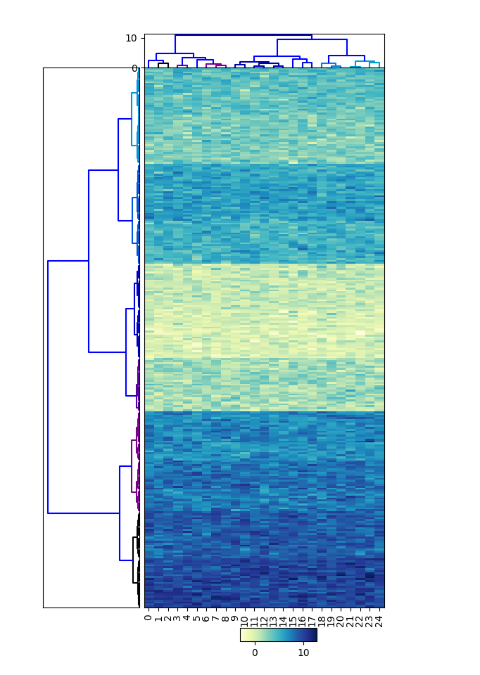
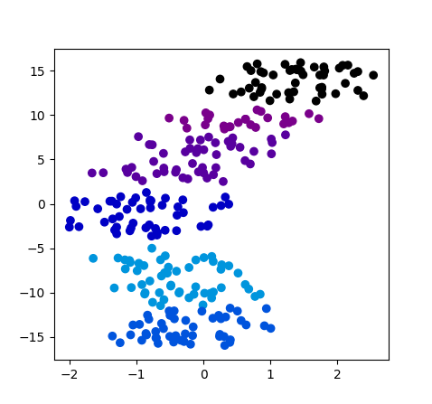

# easy_heatmapper
A python module to create clustered heatmaps and output clusters.

Install
-------

System-wide installation..

	git clone https://github.com/koonimaru/easy_heatmapper.git
	cd easy_heatmapper
	sudo pip3 install .

Using a virtual environment..
	
	sudo apt-get install python3-venv #If you do not have one.
	git clone https://github.com/koonimaru/easy_heatmapper.git
	cd easy_heatmapper
	python3 -m venv ./
	source bin/activate
	pip3 install .

Test installation
-----------------

	cd easy_heatmapper
	python3 test.py

will create a random heatmapper.

Usage
-----

easy_heatmapper.heatmapper(X, xLabels=[],yLabels=[], save=, WRITE_CLUSTER=True, methods="tsne",CPU=, cluster_both=True, SHOW=True)

X: M x N array.

xLabels: N array. The labels/names of data X by column.

yLabels: M array. The labels/names of data X by row.

save: a saving directory with a prefix, e.g., "/home/foo/test". Default is a current directory. If you set as "", no files will be saved.

WRITE_CLUSTER: True or False. Choose if cluster information is output or not. Default=True.

methods: "", "tsne", "umap", "pca". Dimension reduction methods to apply before hierarchical clustering.

CPU: CPU number to use. It has effect only when tsne methods is used.

cluster_both: If True, cluster both x and y axis of data.

SHOW: If True, show a heatmap in runtime.

Example
-------

~~~python
import easy_heatmapper as eh
import numpy as np

#creating noisy matrix
b=np.random.normal(0,1, size=(25,25))
    for i in range(10):
        b=np.concatenate((b, np.random.normal(i+1, 1, size=(25,25) )), axis=0)
b[:]+=np.arange(25)/5.0
np.random.shuffle(b)

eh.heatmapper(b)
~~~

~~~python
import easy_heatmapper as eh
import numpy as np

#creating noisy matrix
b=np.random.normal(0,1, size=(25,25))
    for i in range(10):
        b=np.concatenate((b, np.random.normal(i+1, 1, size=(25,25) )), axis=0)
b[:]+=np.arange(25)/5.0
np.random.shuffle(b)

eh.scatter(b)
~~~

