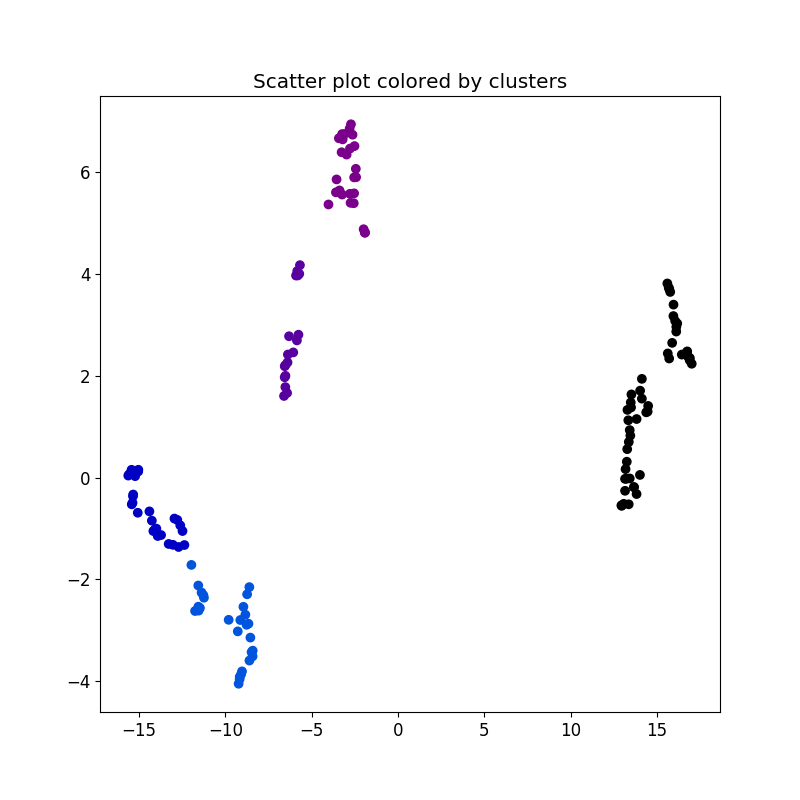

# easy_heatmapper
A python module to create clustered heatmaps and output clusters.

Introduction
------------
easy_heatmapper is a python module to easily draw clustered heatmaps, clustered scatter plot and write cluster information in a text file.

To draw a heatmap, a function called "heatmapper" uses hierarchical clustering with euclidean distance and ward method. It can also apply PCA, t-SNE, UMAP to reduce the dimension of data before hierarchical clustering. 

This module also includes a scatter plot function to plot dimension-reduced data colored by automatically detected clusters with hierarchical clustering.

Installation
------------

System-wide installation..

	git clone https://github.com/koonimaru/easy_heatmapper.git
	cd easy_heatmapper
	sudo pip3 install .

Using a virtual environment..
	
	sudo apt-get install python3-venv #If you do not have one.
	git clone https://github.com/koonimaru/easy_heatmapper.git
	cd easy_heatmapper
	python3 -m venv ./
	source bin/activate
	pip3 install .

Test installation
-----------------

	cd easy_heatmapper
	python3 test.py

will create a random heatmapper.

Usage
-----

**easy_heatmapper.heatmapper(X, xLabels=[],yLabels=[], save=, WRITE_CLUSTER=True, methods="tsne",CPU=, cluster_both=True, SHOW=True, tCOLOR='nipy_spectral', hCOLOR="YlGnBu", _spectral=18, _n_neighbors=5, _min_dist=0.1, _perplexity=50, _n_iter=5000, _pca_comp=2, _color_threshold=0.1)**

X: M x N array.

xLabels: N array. The labels/names of data X by column.

yLabels: M array. The labels/names of data X by row.

save: a saving directory with a prefix, e.g., "/home/foo/test". Default is a current directory. If you set as "", no files will be saved.

WRITE_CLUSTER: True or False. Choose if cluster information is output or not. Default=True.

methods: "", "tsne", "umap", "pca". Dimension reduction methods to apply before hierarchical clustering.

CPU: CPU number to use. It has effect only when tsne methods is used.

cluster_both: True or False. If True, cluster both x and y axis of data.

SHOW: True or False. If True, show a heatmap in runtime.

tCOLOR: Takes the name of matlab colormaps. It sets the colors of clusters in a dendrogram. Default: 'nipy_spectral'.

hCOLOR: Takes the name of matlab colormaps. It sets the colors of clusters in a heatmap. Default: "YlGnBu".

_spectral: Takes an integer. The number of colors to use. If you see different clusters with a same color, increase this number. Default: 18.

_color_threshold: Takes a float number from 0.0 to 1.0. 

&nbsp;

**easy_heatmapper.scatter(X,yLabels=[], save=, WRITE_CLUSTER=True, methods="tsne",CPU=os.cpu_count()//2, SHOW=True, COLOR='nipy_spectral', _spectral=18,_n_neighbors=5, _min_dist=0.1, _perplexity=50, _n_iter=5000, _color_threshold=0.1)**

X: M x N array.

xLabels: N array. The labels/names of data X by column.

yLabels: M array. The labels/names of data X by row.

save: a saving directory with a prefix, e.g., "/home/foo/test". Default is a current directory. If you set as "", no files will be saved. 

WRITE_CLUSTER: True or False. Choose if cluster information is output or not. Default=True.

methods: Takes "", "tsne", "umap", "pca". Dimension reduction methods to apply before hierarchical clustering.

CPU: CPU number to use. It has effect only when tsne methods is used. Default is half of available CPUs.

cluster_both: True or False. If True, cluster both x and y axis of data. Default=True.

SHOW: True or False. If True, show a heatmap in runtime. Default=True.

COLOR: Takes the name of matlab colormaps. It sets the colors of clusters. Default: 'nipy_spectral'.

_spectral: Takes an integer. the number of colors to use. If you see different clusters with a same color, increase this number.

Example
-------

~~~python
import easy_heatmapper as eh
import numpy as np

#creating noisy matrix
b=np.random.normal(0,1, size=(25,25))
for i in range(10):
	b=np.concatenate((b, np.random.normal(i+1, 1, size=(25,25) )), axis=0)
b[:]+=np.arange(25)/5.0
np.random.shuffle(b)

eh.heatmapper(b)
~~~

~~~python
import easy_heatmapper as eh
import numpy as np

#creating noisy matrix
b=np.random.normal(0,1, size=(25,25))
for i in range(10):
	b=np.concatenate((b, np.random.normal(i+1, 1, size=(25,25) )), axis=0)
b[:]+=np.arange(25)/5.0
np.random.shuffle(b)

eh.scatter(b)
~~~

~~~python
from sklearn.datasets import load_iris
import easy_heatmapper as eh
iris = load_iris()
X = iris.data
y = iris.target
eh.scatter(X, methods="umap",yLabels=y)
~~~

